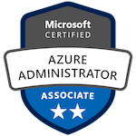

# ¡Hola, soy Ricardo! 👋

## Acerca de mi

Arquitecto de Software certificado en Azure y apasionado en el desarrollo de aplicaciones. Siempre ando buscando nuevos desafíos y formas de construir soluciones geniales en la nube y porque no.. más allá.

## Mis Habilidades

💻 Lenguajes: JavaScript, TypeScript, C#  
🛠️ Herramientas: React, Angular, Node.js, .NET Core  
🌐 Cloud: Microsoft Azure (certificado).  
📊 Bases de Datos: SQL Server, MongoDB.  

## Lo Último

🔭 Actualmente trabajando en proyectos emocionantes con tecnologías Microsoft  
📚 Siempre aprendiendo algo nuevo sobre arquitectura de software y desarrollo web  

## Certificaciones

## ¡Hablemos!

📧 [ricardo.barreno@outlook.com](mailto:ricardo.barreno@outlook.com)  
🔗 [ricardobarreno](https://www.linkedin.com/in/ricardobarreno/)  
